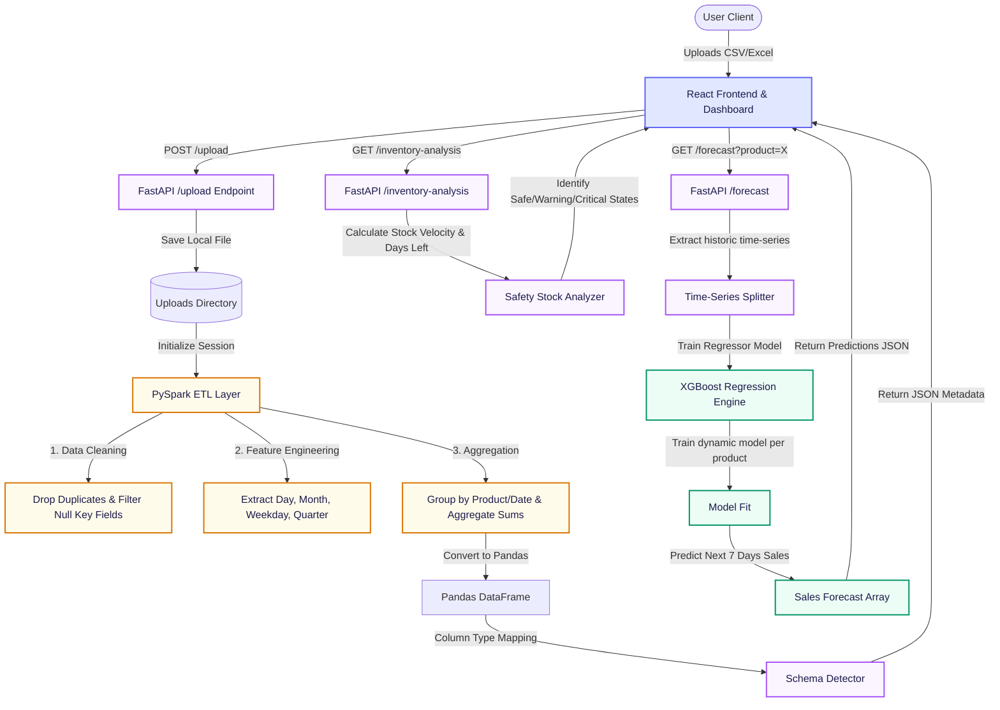

# InventoryIQ 📦📈

> **Predictive Inventory Optimization & Demand Forecasting Platform**

InventoryIQ is a modern full-stack web application designed to help businesses minimize carrying costs, prevent stockouts, and leverage machine learning to forecast demand. By coupling a high-performance **FastAPI** backend with **Apache Spark (PySpark)** and **XGBoost Regressor** models, InventoryIQ scales seamlessly to process large datasets and predict next-7-day product demand.

---

## 🏗️ System Architecture & Data Flow

The following flowchart illustrates the end-to-end data processing, feature engineering, predictive modeling, and user interaction lifecycle:



---

## ⚡ Key Features

* **High-Scale PySpark ETL**: Standardizes raw sales/inventory datasets by handling formatting inconsistencies, missing values, and duplicate records.
* **XGBoost Regression Forecasting**: Dynamically fits a machine learning model per product, utilizing calendar features (day of week, quarter, seasonality) to predict daily demand for the upcoming week.
* **Proactive Inventory Health Alerting**: Calculates depletion velocity and marks products as `SAFE`, `WARNING` (low stock), or `CRITICAL` (immediate stockout risk) based on lead-time schedules.
* **Premium Glassmorphic Dashboard**: A fully responsive interface complete with color-coded alerts, segment filters, and vector chart visualizations (Recharts).
* **Automatic JDK Binding**: Handles modern macOS environments (e.g. Java 24 incompatibility) by dynamically binding PySpark to OpenJDK 17 on startup.

---

## 🛠️ Technology Stack

* **Frontend**: React (JS/Vite), Recharts, Axios, HTML5, Vanilla CSS
* **Backend**: FastAPI, Uvicorn, Python 3.13, Pandas
* **Big Data & ML**: Apache Spark (PySpark 4.1.2), XGBoost (3.2.0), Scikit-Learn
* **Containerization**: Docker, Docker Compose

---

## 🚀 Local Installation & Setup

### System Prerequisites
* **Java Development Kit (JDK 11 or 17)**: PySpark requires a compatible JVM. 
  * *Note: If you are on macOS and using Homebrew, install OpenJDK 17:*
    ```bash
    brew install openjdk@17
    ```
* **Python**: Version 3.10+
* **Node.js**: Version 18+

### Quick Start (Automatic Script)
The quickest way to install dependencies, compile the frontend, set up virtual environments, link the JDK, and run both services is using the root startup script:

```bash
# Clone the repository
git clone https://github.com/Mrinal0044/Inventory_IQ.git
cd Inventory_IQ

# Run the local startup script
./start-local.sh
```

The script will:
1. Verify JDK 17 is present on your system.
2. Initialize and activate the python virtual environment (`backend/venv`).
3. Install backend dependencies in `requirements.txt`.
4. Install npm packages for the React app.
5. Spin up the FastAPI API on `http://127.0.0.1:8000`.
6. Spin up the Vite development server on `http://localhost:5173`.

---

## 🐳 Running with Docker

Alternatively, you can run the entire platform isolated in containers:

```bash
# Build and run the containers
docker-compose up --build
```
* The React frontend will be exposed on **`http://localhost:5173`**
* The FastAPI backend will be exposed on **`http://localhost:8000`**

---

## 📁 Repository Structure
```
├── backend/                  # FastAPI web server
│   ├── app/                  # Application source
│   │   ├── routes/           # Router endpoints (upload, inventory, forecast, category)
│   │   ├── services/         # Spark ETL and ML prediction engines
│   │   └── utils/            # Schema detection helpers
│   ├── Dockerfile
│   ├── requirements.txt      # Python dependencies
│   └── uploads/              # Dynamic folder for active datasets
├── frontend/                 # React UI Dashboard
│   ├── src/                  # React source (pages, components, styles)
│   ├── Dockerfile
│   ├── package.json
│   └── vite.config.js
├── datasets/                 # Synthetic inventory tracking CSV files
├── docker-compose.yml        # Multi-container service definitions
└── start-local.sh            # Project entry point and JVM binder
```
